<h1>Mapping in the Time of Pandemic</h1>
<h3> Tracking the pandemic outbreak in Brazil</h3>

>The primary purpose of this repository is to help people to develop their 
>graphs, maps, and videos using Python, GeoPandas, and Plotly. I will try 
>to keep it updated in terms of Covid-19 Pandemic information in Brazil, 
>but I strongly suggest you visit the below sites for more info.
<h3>More information: </h3>

Brazil:
- <a href="https://wcota.me/covid19br"> https://wcota.me/covid19br </a>
- <a href="https://brasil.io/covid19/"> https://brasil.io/covid19/ </a>

World:
- <a href="https://www.worldometers.info/coronavirus/"> Worldometers Daily Data </a>
- <a href="https://ig.ft.com/coronavirus-chart/?areas=bra&areas=usa&areas=rus&areas=mex&areas=gbr&areas=ita&areasRegional=usny&areasRegional=usnj&cumulative=0&logScale=1&perMillion=0&values=deaths">FT - Coronavirus tracked</a>

<h3>Content of subfolders:</h3>

- <a href="https://github.com/Mjrovai/Mapping_Covid-19_Brazil/tree/master/videos"> /videos </a>  - Short videos showing the development of Covid-19 in Brazil and main States.

- <a href="https://github.com/Mjrovai/Mapping_Covid-19_Brazil/tree/master/graphs"> /graphs </a>  - Timeline graphs of main brazilian cities

- <a href="https://github.com/Mjrovai/Mapping_Covid-19_Brazil/tree/master/images"> /images </a>  - Most updated maps 

- <a href="https://github.com/Mjrovai/Mapping_Covid-19_Brazil/tree/master/notebooks"> /notebooks </a>  - Code used to get Graphs, Maps, Gifs, and Videos

<h3>Datasets:</h3>

 

- <a href="https://github.com/wcota/covid19br"> Confirmed cases by day, using information from the news </a> 

- <a href="https://brasil.io/dataset/covid19/caso/"> Raw data by city compiled from original dataset provided by Brasil.IO </a>

<h3>Thanks to: </h3>

- <a href="https://wesleycota.com"> Wesley Cota </a> Universidade Federal de Viçosa, Brazil and Universidad de Zaragoza, Spain 

- <a href="https://blog.brasil.io/author/alvaro-justen.html"> Alvaro Justen </a> Brasil.IO

<h3>License: </h3> 
- <a href="https://creativecommons.org/licenses/by-sa/4.0/"> CC BY-SA 4.0</a> Creative Commons Attribution-ShareAlike 4.0 International

<h3>General Situation in Brazil:</h3> 
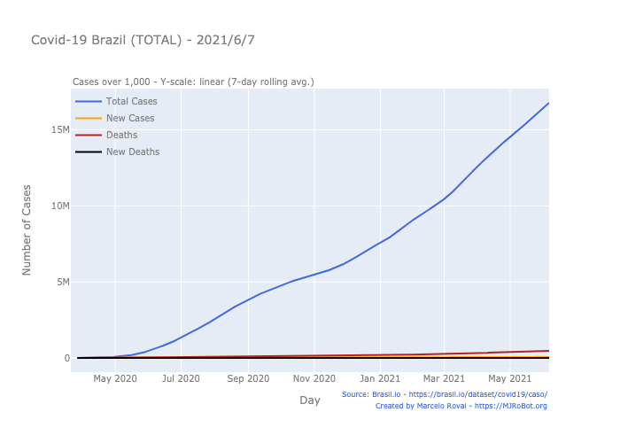
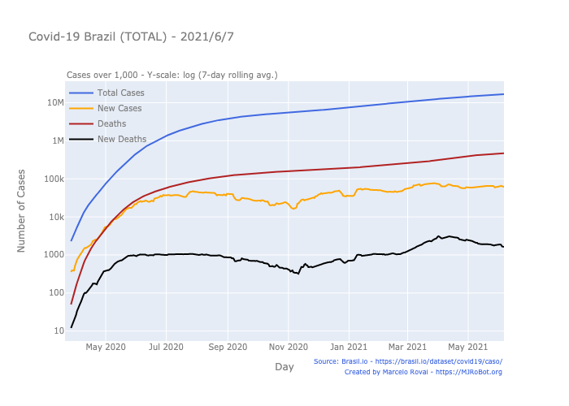
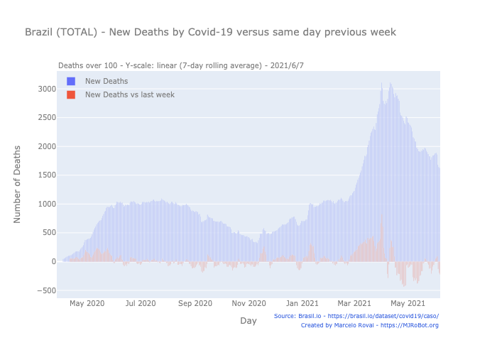
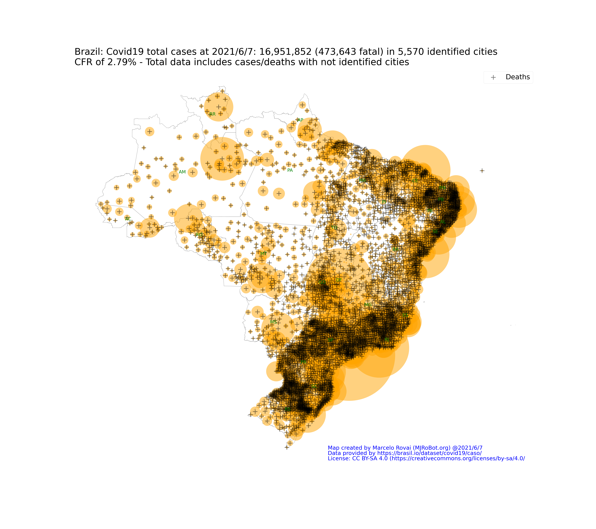
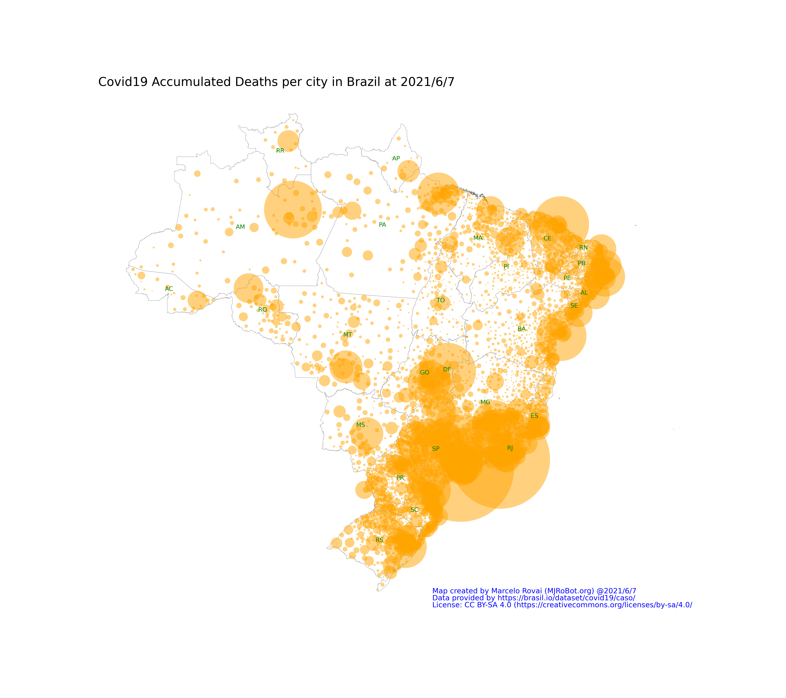

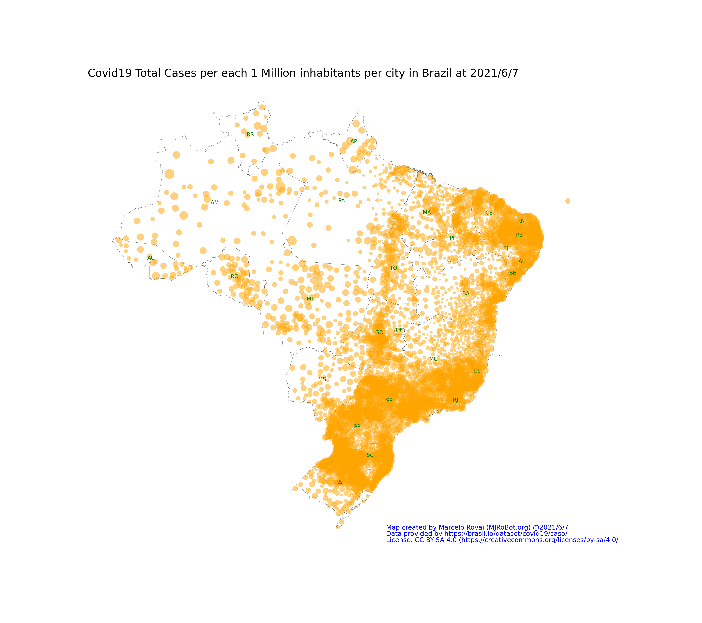
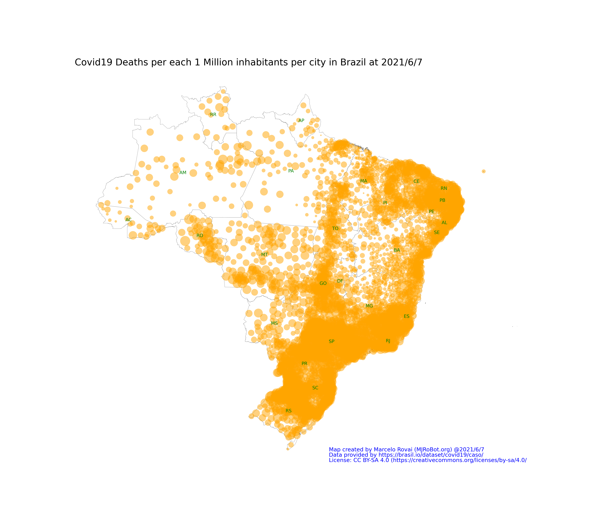

<h3>Specific situation in the Main States</H3>
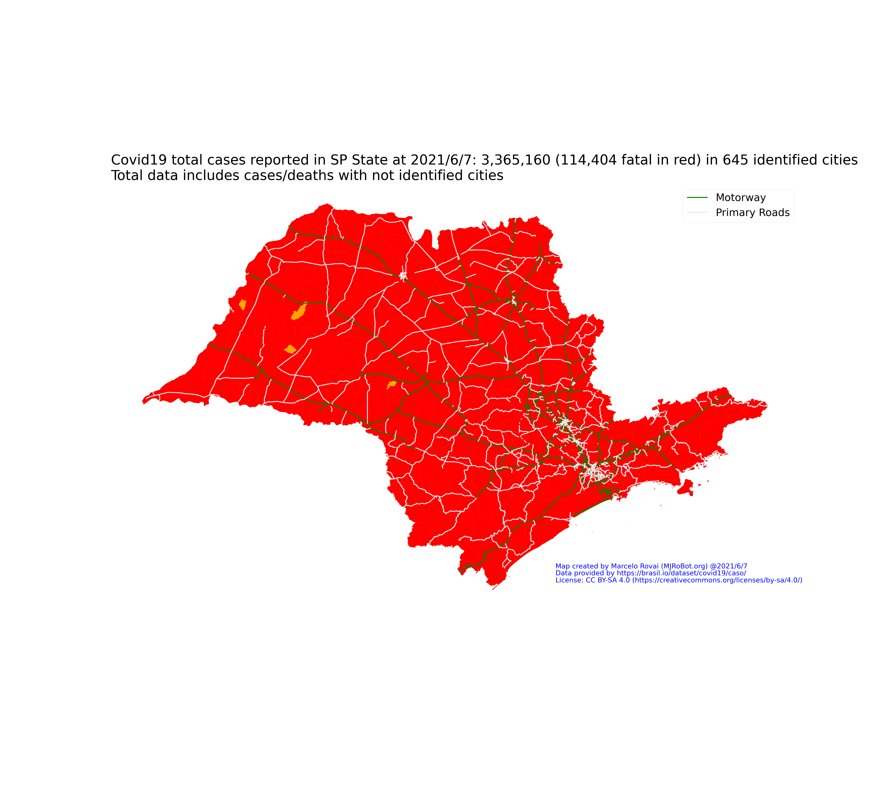
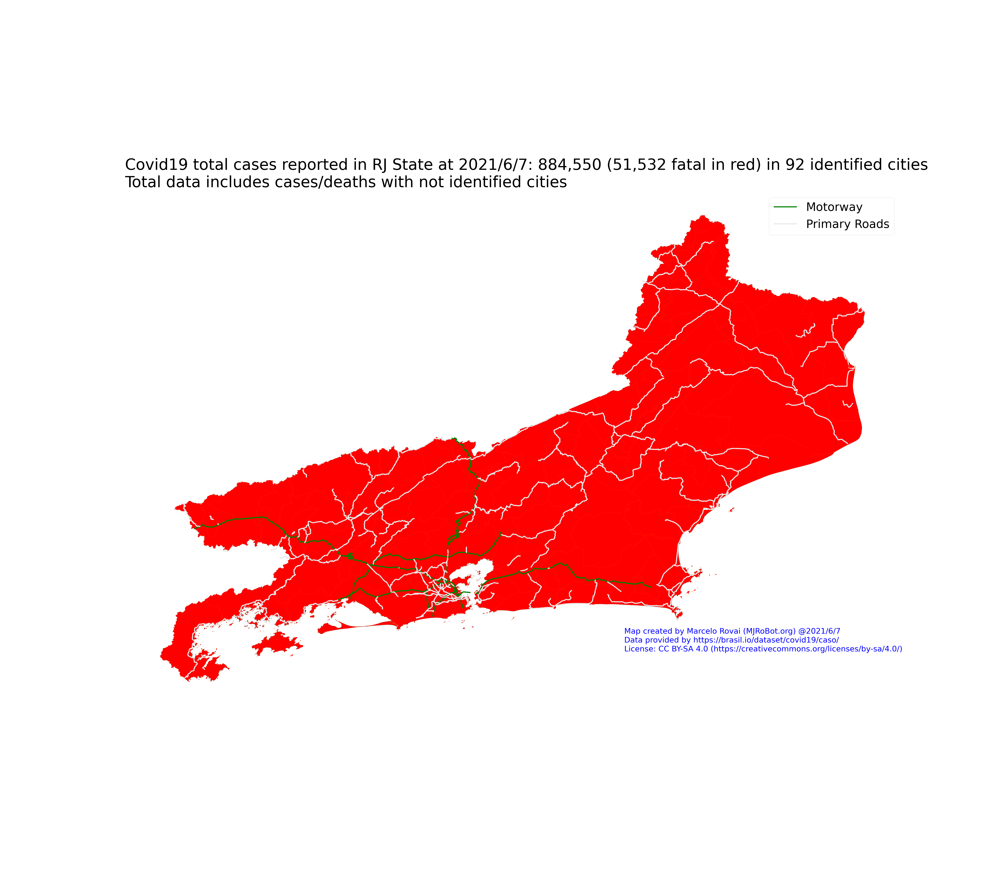
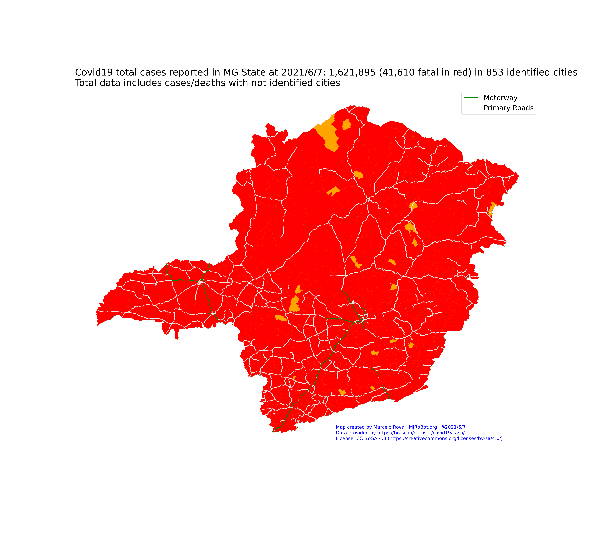
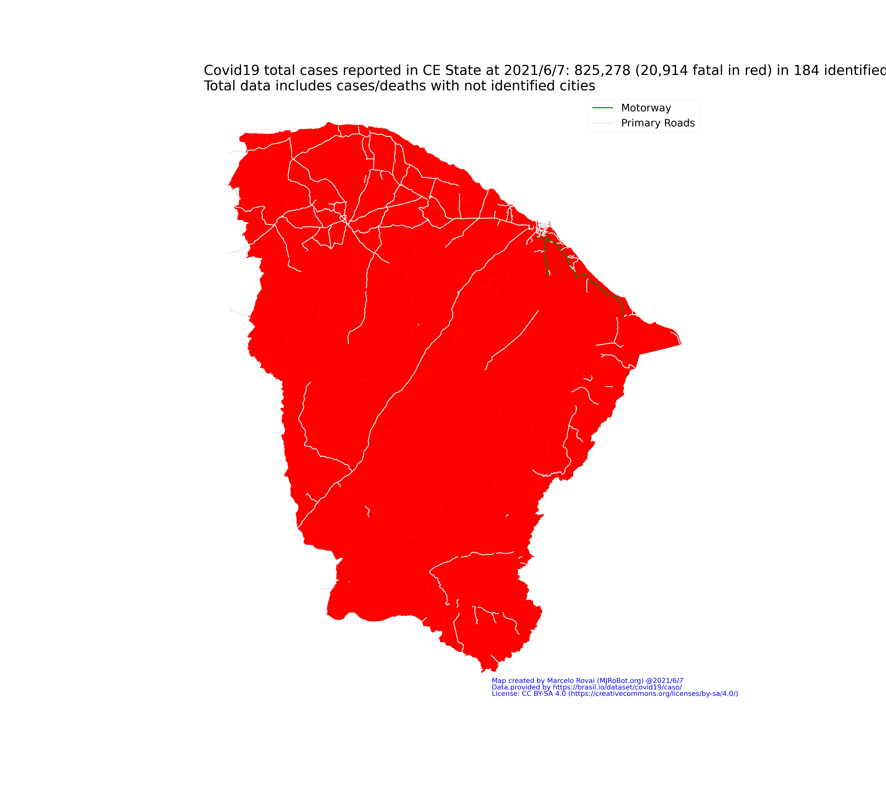
